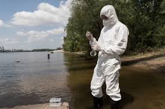

<!DOCTYPE html>
<html lang="es">
<head>
    <meta charset="UTF-8">
    
 
<meta name="viewport" content="width=device-width, initial-scale=1.0">
    
 
<title>NOTICIAS LOS 5</title>
    

</head>
<body>
    <h1>"Alerta por Peligros Químicos: Protegiendo la Salud en un Mundo Contaminado"</h1>
	
    

Fecha: <time datetime="2024-02-24">24 de febrero de 2024</time>

    

    

En un mundo cada vez más industrializado, la exposición a peligros químicos se ha convertido en una preocupación creciente para la salud pública. La presencia de sustancias tóxicas en nuestro entorno cotidiano plantea riesgos significativos para la salud humana y el medio ambiente. En esta nota, exploraremos algunos de los peligros químicos comunes y las medidas que podemos tomar para protegernos.

Contaminación del Agua:
La contaminación química del agua es un problema crítico en muchas regiones. Sustancias como los pesticidas, metales pesados y productos químicos industriales pueden infiltrarse en suministros de agua potable, representando amenazas para la salud humana y la vida acuática.

     
	 

	 
	 

	 

Exposición en el Hogar:
Productos de uso diario, desde productos de limpieza hasta muebles y electrónicos, a menudo contienen sustancias químicas nocivas. La exposición constante a estos productos puede contribuir a problemas de salud a largo plazo, como alergias, enfermedades respiratorias y problemas hormonales.Consejos para prevenir accidentes con productos químicos en el hogar
1) LEA ATENTAMENTE LA ETIQUETA ANTES DEL USO.

2) No manipule el producto sin haber leído y comprendido todas las instrucciones de seguridad.

3) Mantenga fuera del alcance de niños y mascotas.

4) No mezcle nunca con otros productos.

5) Evite el contacto con ojos, piel y ropa.

6) Conserve siempre en su envase original.

7) Mantenga los cierres de seguridad originales, estos deben permanecer bien cerrados, hay que evitar en todo momento que los productos puedan derramarse.

8) Guarde bajo llave.

9) Almacene separados de otros productos químicos peligrosos con los que puede reaccionar.

10) Almacene siempre separados de alimentos y bebidas.

11) Mantenga alejados de fuentes de calor y humedad. Proteger de la luz del sol.

12) Utilice la indumentaria adecuada durante el uso de cada producto. (Guantes, gafas protectoras, mascarilla…)

13) No coma, beba ni fume durante su manipulación y aplicación.

14) Respete los usos y modo de aplicación establecidas.

15) Respete, en el caso de que no se trate de productos preparados para su uso, las diluciones contempladas en la etiqueta.

16) Respete la fecha de caducidad.

17) Elimine correctamente el envase y los restos de producto contaminado o caducado. Evitar su liberación al medio ambiente.

18) Si se siente mal durante el uso o nota algún tipo de reacción desagradable detenga la manipulación y/o aplicación.

19) Tenga en cuenta los primeros auxilios.

20) Si necesita asistencia médica, tenga a mano el envase o la etiqueta original del producto

     

	 
	 

	 

Riesgos Laborales:
Los trabajadores en industrias químicas y manufactureras enfrentan riesgos específicos de exposición a sustancias peligrosas. Las prácticas laborales seguras y el uso adecuado de equipos de protección son esenciales para mitigar estos riesgos.
Para garantizar la seguridad de los empleados y el entorno laboral, es fundamental prevenir accidentes con productos químicos de alto riesgo en el lugar de trabajo. Estos son algunos consejos para reducir los riesgos:

Conocimiento de los químicos:

Familiarízate con las propiedades, los riesgos y las medidas de seguridad recomendadas de los productos químicos utilizados en su lugar de trabajo.
Evaluar los riesgos:

Realiza una evaluación de riesgos para identificar posibles peligros y crear métodos para prevenirlos.
Administración adecuada:

Siguiendo las instrucciones del fabricante y las normativas de seguridad locales, almacena los productos químicos de manera adecuada.
Señalización y etiquetado:

Asegúrate de que todas las etiquetas de productos químicos sean precisas. Zonas de almacenamiento y áreas de riesgo deben ser marcadas con señales claras.

     
	 

	 
	 

Contaminación del Aire:
Las emisiones de fuentes industriales, vehículos y actividades agrícolas contribuyen a la contaminación del aire. Compuestos como los óxidos de nitrógeno y los compuestos orgánicos volátiles pueden tener efectos adversos en la salud respiratoria y cardiovascular.
Cuando se encuentran en concentraciones elevadas en el aire, hay una variedad de productos químicos que pueden poner en peligro la salud humana y el medio ambiente. El aire contiene una variedad de químicos altamente peligrosos, incluidos:

El dióxido de azufre (SO2) es principalmente producido por la quema de combustibles fósiles, como el petróleo y el carbón. Puede causar problemas respiratorios y fomentar la formación de lluvia ácida.

Los óxidos de nitrógeno (NOx) son principalmente el resultado de la combustión de combustibles en vehículos y plantas de energía. Pueden causar smog y afectar la salud respiratoria.

Monóxido de carbono (CO): es una sustancia producida por la combustión incompleta de combustibles. Es inodoro e incoloro, pero en concentraciones altas puede ser mortal porque reduce la capacidad de la sangre.

      
	  
	  

	 
	 
	 

	 
<h2>Medidas de Protección:</h2>

Información y Educación: Conocer los riesgos químicos y estar informado sobre los productos que usamos es fundamental.
Regulación y Cumplimiento: Es crucial que las autoridades establezcan y hagan cumplir regulaciones para limitar la presencia de sustancias peligrosas.
Alternativas Seguras: Promover el uso de productos y tecnologías menos tóxicos y más respetuosos con el medio ambiente.
La conciencia y la acción son clave para enfrentar los peligros químicos en nuestro entorno. Al adoptar medidas proactivas a nivel personal y comunitario, podemos trabajar hacia un mundo más seguro y saludable para las generaciones futuras.
Para asegurar la seguridad de las personas que trabajan en entornos donde están expuestas a sustancias peligrosas, es esencial que se protejan contra productos químicos de alto riesgo. Se deben tener en cuenta las siguientes precauciones de protección química:

Personal Protection Pack (EPP):

Trajes de protección química: use ropa creada para protegerse de productos químicos peligrosos. Los trajes impermeables suelen tener capuchas y guantes.
Guantes y Botas: Tenga en cuenta la compatibilidad química antes de seleccionar guantes y botas que sean resistentes a productos químicos específicos.
Caretas y Gafas: Use caretas o gafas de seguridad que protejan adecuadamente los ojos contra salpicaduras químicas.
Ventiladores:

Garantizar que los lugares de trabajo estén bien ventilados para reducir la inhalación de vapores tóxicos

 

	 
	 
	 

	 
    
Por: periodico finito

</body>

</html>
